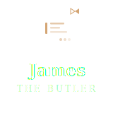

<p align="center">
  
</p>

<h1 align="center">James the Butler</h1>

<p align="center">
  An AI-native agent platform with Elixir/Phoenix backend, Vue 3 frontend (web + Tauri desktop), Flutter mobile client, and Python CI/CD tooling.
</p>

---

## Brand Assets

<table>
  <tr>
    <td align="center"><strong>Icon</strong><br></td>
    <td align="center"><strong>Icon (Light)</strong><br></td>
    <td align="center"><strong>Favicon</strong><br></td>
    <td align="center"><strong>Badge</strong><br></td>
  </tr>
  <tr>
    <td align="center" colspan="2"><strong>Horizontal</strong><br></td>
    <td align="center" colspan="2"><strong>Stacked</strong><br></td>
  </tr>
  <tr>
    <td align="center" colspan="4"><strong>Inline</strong><br></td>
  </tr>
  <tr>
    <td align="center" colspan="2" style="background:#1a1a2e;padding:12px"><strong style="color:#fff">Horizontal (Light)</strong><br></td>
    <td align="center" colspan="2" style="background:#1a1a2e;padding:12px"><strong style="color:#fff">Stacked (Light)</strong><br></td>
  </tr>
</table>

**Colors:** Navy `#1a1a2e` / Gold `#d4a574` / White `#ffffff`

---

## Quick Start

```bash
make setup    # Install all dependencies (zero-install per component)
make dev      # Start all services in development mode
make test     # Run all test suites
make lint     # Lint all components
make archgate # Run architecture gate checks
```

## Project Layout

| Directory                | Stack           | Purpose                              |
|--------------------------|-----------------|--------------------------------------|
| `backend/`               | Elixir/Phoenix  | API server, OpenClaw, meta-planner   |
| `frontend/`              | Vue 3 / Tauri   | Web UI and desktop app               |
| `mobile/`                | Dart/Flutter    | Mobile remote viewer and controller  |
| `tools/pipeline_runner/` | Python/Poetry   | CI/CD pipeline and archgate          |

## Specifications

Start with **[spec/platform.md](spec/platform.md)** for the full platform vision. Component specs live in `spec/` at both the root and within each component directory. See `spec/README.md` for the reading order.

## Development

Each component follows a **zero-install** principle — given the base runtime, running the setup command installs everything locally:

```bash
make backend-setup     # mix deps.get && mix compile
make frontend-setup    # npm ci
make mobile-setup      # flutter pub get
make pipeline-setup    # poetry install
```

## Architecture Decision Records

Significant decisions are documented in **[docs/adr/](docs/adr/README.md)**.

## License

[MIT](LICENSE)
